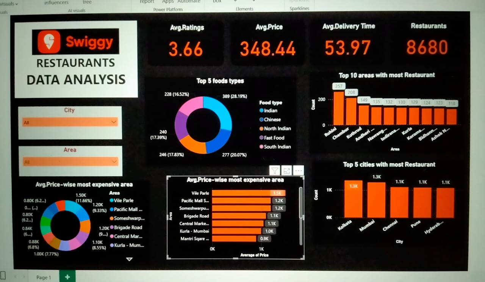

# 🍽️ Swiggy Data Analysis using Power BI

## 📊 Project Overview

This project involves analyzing Swiggy food delivery data using **Power BI** to uncover key business insights. The goal is to explore customer behavior, restaurant performance, delivery trends, and order patterns to support data-driven decision-making.

---

## 🔍 Objectives

- Analyze Swiggy's historical data to understand order distribution and customer trends.
- Identify high-performing restaurants and popular cuisines.
- Examine order delivery patterns across cities and time.
- Create interactive and insightful Power BI dashboards.

---

## 🧾 Dataset

- **Source:** YouTube (Educational Purpose)  
- **Channel:** [https://youtu.be/u8UBu78dWug?si=FqGCsymQ0QfymxdQ]  
- **Description:** The dataset includes customer orders, restaurant details, delivery info, ratings, and pricing.

**Sample Columns:**
- `Order_ID`
- `Customer_City`
- `Restaurant_Name`
- `Cuisine_Type`
- `Order_Date`
- `Delivery_Time`
- `Cost_of_Order`
- `Rating`

---

## 📈 Tools & Technologies

- **Power BI** – for data visualization and dashboard development
---

## 🧠 Key Insights

Some of the business questions answered:

- 🔝 Which are the top-performing restaurants?
- 🏙️ Which cities generate the most orders?
- ⏰ What are the peak order times?
- 💸 What is the average order value?
- 🌮 Which cuisine is most popular?

---

## 📊 Dashboard Overview

## 📂 Project Structure

Swiggy-PowerBI-Analysis/
├── Dataset/
│ └── swiggy_data.csv
├── PowerBI/
│ └── Swiggy_Analysis.pbix
├── Images/
│ └── dashboard1.png
└── README.md

## ✅ Conclusion

This Power BI dashboard provides a holistic view of Swiggy's operations and customer behavior, helping stakeholders make informed business decisions. It highlights growth opportunities, restaurant performance, and key user trends.

---
**Created by:** Varun G
